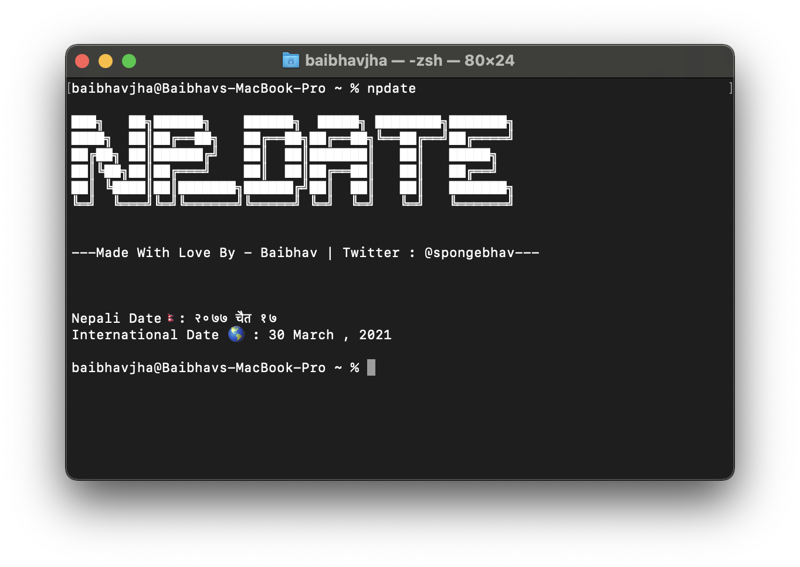
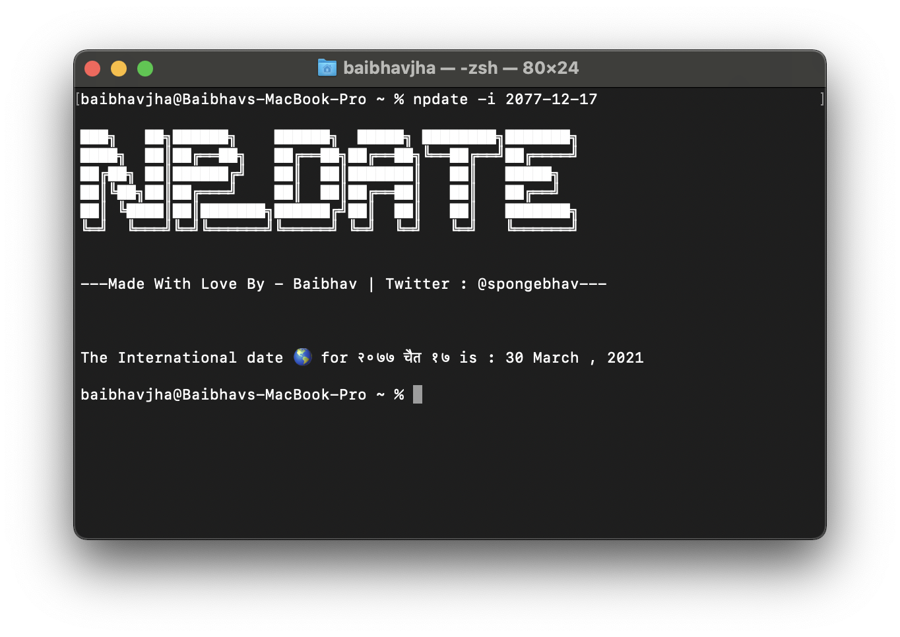
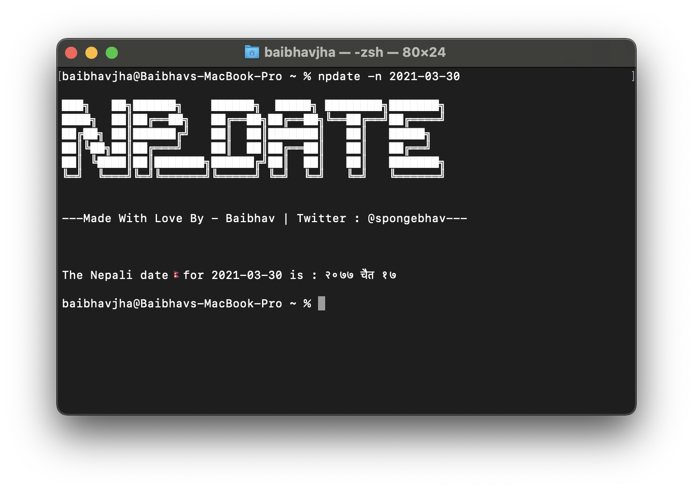

<pre>
███╗   ██╗██████╗    ██████╗  █████╗ ████████╗███████╗
████╗  ██║██╔══██╗   ██╔══██╗██╔══██╗╚══██╔══╝██╔════╝
██╔██╗ ██║██████╔╝   ██║  ██║███████║   ██║   █████╗ 
██║╚██╗██║██╔═══╝    ██║  ██║██╔══██║   ██║   ██╔══╝  
██║ ╚████║██║███████╗██████╔╝██║  ██║   ██║   ███████╗
╚═╝  ╚═══╝╚═╝╚══════╝╚═════╝ ╚═╝  ╚═╝   ╚═╝   ╚══════╝
</pre>

<pre>Tested on macOS Big Sur and Ubuntu.</pre>

# Description
## It is a bash script that allows you to see both Nepali as well as International date in comfort of your terminal. It also allows you to convert International Date to Nepali Date and vice versa.

# Usage

<pre>npdate</pre>
It will simply show you Today's Nepali and International Date.

<pre>npdate -i {Nepali Date in YYYY/MM/DD format}</pre>
It will convert the Nepali Date you provide to International Date.

<pre>npdate -n {International Date in YYYY/MM/DD format}</pre>
It will convert the International Date you provide to Nepali Date.

